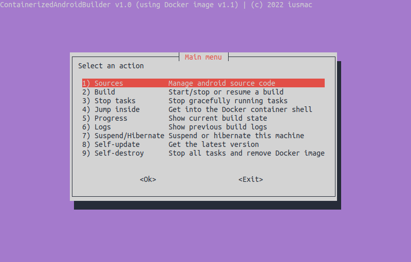
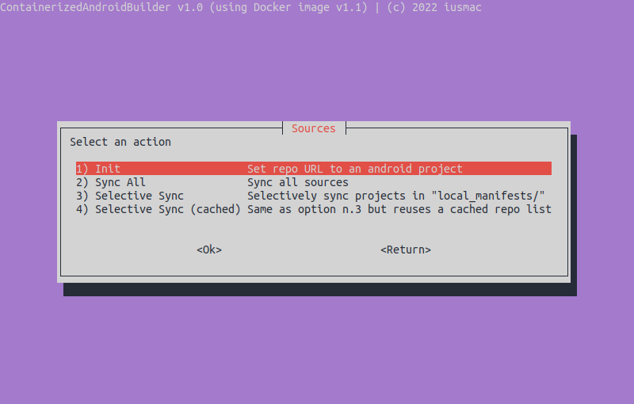
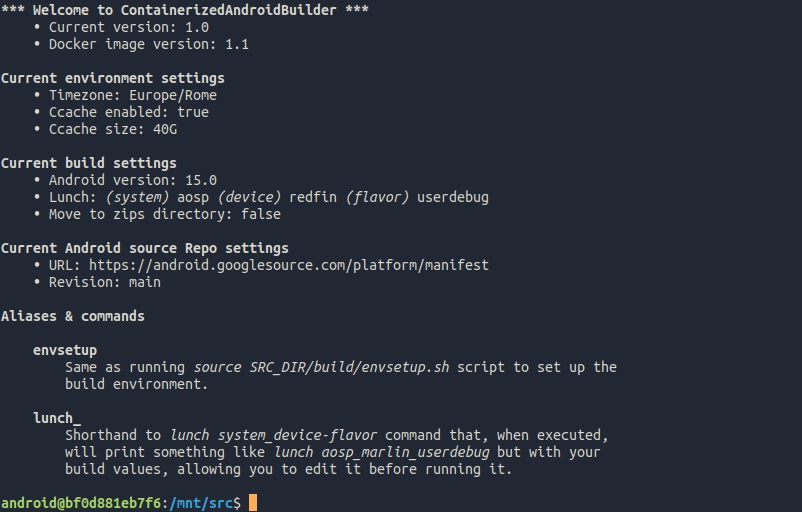

<p align="center"></p>

# ContainerizedAndroidBuilder <a href="https://github.com/iusmac/ContainerizedAndroidBuilder/tags"></a> <a href="https://hub.docker.com/r/iusmac/containerized_android_builder"> </a> <a href="./LICENSE"></a>

ContainerizedAndroidBuilder is a tool that encapsulates the entire Android ROM building process within a Docker container. To simplify your life even further, it features an intuitive terminal user interface (TUI) that organizes common actions into menus you will need when building any Android-based ROM. It's particularly suitable if you want to manage your trees with ease on your _not-very-powerful_ machine (e.g., smartphone), but perform the actual build on another more capable machine (e.g., remote server).

This tool is designed to be shipped as a Git submodule, which allows to reuse the Android sources and other common directories when building for multiple devices/flavors.

<p align="center">
    
    
    
</p>

## Advantages
<details><summary>Easy to use</summary>

This tool is perfect for lazy or inexperienced users who simply want to build a ROM without too much hassle. All required dependencies are already bundled in the Docker image.
</details>
<details><summary>Clean system</summary>

Since all files/directories are in one place and dependencies are "containerized", your current system won't get dirty. Whenever you want, use the `Self-destroy` menu option to remove Docker image entirely and free up allocated disk space.
> N.B.: source trees, compiled Android and cache files will remain unaffected, and will stay intact on your disk. You have to remove them manually.
</details>
<details><summary>Platform-agnostic</summary>

Containerization allows to reduce to minimal machine-dependent failures and dependency conflicts when building, which makes this tool work seamlessly in any environment.
</details>
<details><summary>Optimized disk usage</summary>

You can easily move around the Android sources and compiled output files, even across different disks using `--src-dir` and `--out-dir` arguments.
</details>

## Installation
1. **Create a directory for your future Android build:**
    ```console
    mkdir AndroidBuilder && cd $_
    ```

2. **Init a Git project in it:**
    ```console
    git init -b device_codename
    ```
    Replace `device_codename` with your device codename.

    _Note: the best practice is to always create a branch per device. This will allow to reuse the submodule, source tree and other common directories._

3. **Add this repo as a submodule:**
    ```console
    git submodule add https://github.com/iusmac/ContainerizedAndroidBuilder.git
    ```

4. **Create a wrapper script (e.g., `builder.sh`) for the submodule:**
    ```console
    touch builder.sh && chmod +x $_
    ```

   Place submodule execution in it:
    ```bash
    #!/usr/bin/env bash
    ./ContainerizedAndroidBuilder/run.sh \
        --android <Android version> \
        --repo-url <Repo URL> \
        --repo-revision <Repo revision> \
        --lunch-system <Lunch system> \
        --lunch-device <Lunch device> \
        --lunch-flavor <Lunch flavor>
    ```
    _Note: replace the placeholders with the appropriate values, example:_
    ```bash
    #!/usr/bin/env bash
    ./ContainerizedAndroidBuilder/run.sh \
        --android 15.0 \
        --repo-url https://android.googlesource.com/platform/manifest \
        --repo-revision main \
        --lunch-system aosp \
        --lunch-device redfin \
        --lunch-flavor userdebug
    ```

5. **_(Optional)_ Create _local_manifests/_ directory for additional _.xml_ files:**
    ```console
    mkdir local_manifests
    ```
    _Discover more about [Local Manifests](https://gerrit.googlesource.com/git-repo/+/master/docs/manifest-format.md#local-manifests)._

6. **Make sure your final project has the following directory structure:**
    ```
    AndroidBuilder/
    ├── .git/
    ├── .gitmodules
    ├── builder.sh
    ├── ContainerizedAndroidBuilder/
    └── local_manifests/
    ```

7. **(Recommended) Commit the changes and push to your repository:**
    ```console
    git add -A
    git commit -m "Init"
    git push
    ```
    This way you and others can obtain the pre-configured project with the submodule just by cloning it:
    ```console
    git clone --recursive https://github.com/.../AndroidBuilder.git
    ```
    **(!) Pay attention to the _--recursive_ option. It is necessary to 'hook' the _ContainerizedAndroidBuilder_ module from `.gitmodules` file during cloning.**

8. **Get Docker on your system**
    ```console
    curl -fsSL https://get.docker.com | sudo sh -
    ```
    _Note: strictly follow the installation guide. It's fully automatic for Unix-like systems, but requires some manual intervention on Windows or MacOS systems._

    Ensure Docker is installed:
    ```console
    docker --version
    Docker version 20.10.17, build 100c701
    ```

9. **Well done! Run the `builder.sh` and start building now! :)**

## Usage
```
$ ./run.sh --help
Usage: ./run.sh
    --android ANDROID
    --repo-url REPO_URL
    --repo-revision REPO_REVISION
    --lunch-system LUNCH_SYSTEM
    --lunch-device LUNCH_DEVICE
    --lunch-flavor LUNCH_FLAVOR
    [--email EMAIL]
    [--src-dir SRC_DIR]
    [--out-dir OUT_DIR]
    [--zips-dir ZIPS_DIR]
    [--move-zips MOVE_ZIPS]
    [--ccache-dir CCACHE_DIR]
    [--ccache-disabled]
    [--ccache-size CCACHE_SIZE]
    [--timezone TIMEZONE]
    [--help] [--version]
```

**Description of required arguments:**
Argument                                     | Description
-------------------------------------------- | -----------
`--android ANDROID`                          | Android version to build. Possible values: `10.0`, `11.0`, `12.0`, `12.1`, `13.0`, `14.0`
`--repo-url URL`                             | URL for `repo init -u {URL}` command. Example: `https://android.googlesource.com/platform/manifest`
`--repo-revision REVISION_NAME`              | Branch/revision for `repo init -u {URL} -b {REVISION_NAME}` command. Example: `main`
`--lunch-system SYSTEM`                      | System name for `lunch {SYSTEM}_device-flavor` command. Example: `aosp`
`--lunch-device DEVICE`                      | Device codename for `lunch system_{DEVICE}-flavor` command. Example: `redfin`
`--lunch-flavor FLAVOR`                      | Build type/flavor for `lunch system_device-{FLAVOR}` command. Possibile values: `user`, `userdebug`, or `eng`.

**Description of optional arguments:**
Argument                                     | Description
-------------------------------------------- | -----------
`--email EMAIL`                              | E-mail for `git config user.email {EMAIL}` command. Defaults to `docker@localhost`.
`--src-dir SRC_DIR`                          | Absolute path to source tree. Defaults to `src/` in current working directory.
`--out-dir OUT_DIR`                          | Absolute path to output directory. Defaults to `out/` in current working directory.
`--zips-dir ZIPS_DIR`                        | Absolute path to zips directory. Defaults to `zips/` in current working directory.
`--move-zips`                                | Whether the _.zip_ and the _boot.img_ files need to be moved<br>from `{OUT_DIR}/target/product/{LUNCH_DEVICE}` directory to `zips/` directory.
`--ccache-dir CCACHE_DIR`                    | Absolute path to compiler cache directory. Defaults to `ccache/` in current working directory.
`--ccache-disabled`                          | Whether the compiler cache should be disabled.
`--ccache-size CCACHE_SIZE`                  | Maximum compiler cache size. Defaults to `30GB`.
`--timezone TIMEZONE`                        | Timezone used inside Docker container. Defaults to the `$TZ` environment variable.<br>The value shall respect the timezone syntax, example: `America/New_York`. See <a href="https://en.wikipedia.org/wiki/List_of_tz_database_time_zones">list of tz database time zones</a><br><br><em>Note: in case your shell doesn't declare `$TZ` variable, the script will try to detect<br>TZ using `timedatectl` command. If it fails, the script will attempt to fetch<br>timezone from URL `http://ip-api.com/line?fields=timezone`.</em>

## Directory structure
This is the final directory structure you should expect after running the TUI app at least ones.
Directory                                    | Description
-------------------------------------------- | -----------
`cache/`                                     | Contains the entire `/home/android` directory with caches & shell config files extracted from the container and other temporary files.
`ccache/`                                    | Contains _ccache.conf_ config file and compiler cache files.
`ContainerizedAndroidBuilder/`               | Contains the builder itself shipped as submodule.
`local_manifests/`                           | Contains additional remotes and projects copied to `{SRC_DIR}/.repo/local_manifests`.
`logs/`                                      | Contains some useful build infos.
`misc/`                                      | Contains miscellaneous files (e.g., configs) needed for customizations.
`src/`                                       | Contains Android source code.
`out/`                                       | Contains compiled Android files.
`zips/`                                      | Contains _.zip_ and _boot.img_ files if `--move-zips` option is passed.

## Navigation in TUI menus
Key                                          | Description
-------------------------------------------- | -----------
`Arrows` (←↑↓→)                              | Move between options.
`Enter` (↵)                                  | Confirm action.
`Tab` (↹)                                    | Change focus.
`Space` (␣)                                  | Select option(s) from the checkbox & radio lists.
`Escape` (Esc)                               | Return or exit.

## Optimizing build times & other tips
If you'd like to build as fast as possible, try to apply as many of these tips as you can.

<details><summary><h4>RAM Optimizations</h4></summary><blockquote>
<details><summary><strong>Avoid <code>java.lang.OutOfMemoryError: Java heap space</code> error</strong></summary><blockquote>
Although Google suggests you to have at least 16GB of RAM in order to build Android, you may still occasionally observe the build being killed by the Out of Memory (OOM) killer.

To be able to build on 16GB (even 8GB) RAM machine without being killed by the Out of Memory (OOM) killer, apply these patches in _[SRC_DIR]/build/soong_ directory:
<details><summary>For Android 15:</summary>

```diff
diff --git a/java/droidstubs.go b/java/droidstubs.go
index b32b754..3a37aa1 100644
--- a/java/droidstubs.go
+++ b/java/droidstubs.go
@@ -784,6 +784,7 @@ func metalavaCmd(ctx android.ModuleContext, rule *android.RuleBuilder, srcs andr
 	cmd.BuiltTool("metalava").ImplicitTool(ctx.Config().HostJavaToolPath(ctx, "metalava.jar")).
 		Flag(config.JavacVmFlags).
 		Flag(config.MetalavaAddOpens).
+		Flag("-J-Xmx6114m").
 		FlagWithArg("--java-source ", params.javaVersion.String()).
 		FlagWithRspFileInputList("@", android.PathForModuleOut(ctx, fmt.Sprintf("%s.metalava.rsp", params.stubsType.String())), srcs).
 		FlagWithInput("@", srcJarList)
```
</details>
<details><summary>For Android 14:</summary>

```diff
diff --git a/java/droidstubs.go b/java/droidstubs.go
index 9556e956ac..b46eb58798 100644
--- a/java/droidstubs.go
+++ b/java/droidstubs.go
@@ -722,6 +722,7 @@ func metalavaCmd(ctx android.ModuleContext, rule *android.RuleBuilder, javaVersi
 	cmd.BuiltTool("metalava").ImplicitTool(ctx.Config().HostJavaToolPath(ctx, "metalava.jar")).
 		Flag(config.JavacVmFlags).
 		Flag(config.MetalavaAddOpens).
+		Flag("-J-Xmx6114m").
 		FlagWithArg("--java-source ", javaVersion.String()).
 		FlagWithRspFileInputList("@", android.PathForModuleOut(ctx, "metalava.rsp"), srcs).
 		FlagWithInput("@", srcJarList)
```
</details>
<details><summary>For Android 12.x/13:</summary>

```diff
diff --git a/java/droidstubs.go b/java/droidstubs.go
index c756815c62..37cb4c8d9b 100644
--- a/java/droidstubs.go
+++ b/java/droidstubs.go
@@ -415,6 +415,7 @@ func metalavaCmd(ctx android.ModuleContext, rule *android.RuleBuilder, javaVersi
 
 	cmd.BuiltTool("metalava").ImplicitTool(ctx.Config().HostJavaToolPath(ctx, "metalava.jar")).
 		Flag(config.JavacVmFlags).
+		Flag("-J-Xmx6114m").
 		Flag("-J--add-opens=java.base/java.util=ALL-UNNAMED").
 		FlagWithArg("-encoding ", "UTF-8").
 		FlagWithArg("-source ", javaVersion.String()).
```
</details>
<details><summary>For Android 11:</summary>

```diff
diff --git a/java/droiddoc.go b/java/droiddoc.go
index b564fea014..ddc0682a1c 100644
--- a/java/droiddoc.go
+++ b/java/droiddoc.go
@@ -1474,6 +1474,7 @@ func metalavaCmd(ctx android.ModuleContext, rule *android.RuleBuilder, javaVersi
 
 	cmd.BuiltTool(ctx, "metalava").
 		Flag(config.JavacVmFlags).
+		Flag("-J-Xmx6114m").
 		FlagWithArg("-encoding ", "UTF-8").
 		FlagWithArg("-source ", javaVersion.String()).
 		FlagWithRspFileInputList("@", srcs).
```
</details>
<details><summary>For Android 10:</summary>

```diff
diff --git a/java/droiddoc.go b/java/droiddoc.go
index 30a968d6..362acf91 100644
--- a/java/droiddoc.go
+++ b/java/droiddoc.go
@@ -73,7 +73,7 @@ var (
 			Command: `rm -rf "$outDir" "$srcJarDir" "$stubsDir" && ` +
 				`mkdir -p "$outDir" "$srcJarDir" "$stubsDir" && ` +
 				`${config.ZipSyncCmd} -d $srcJarDir -l $srcJarDir/list -f "*.java" $srcJars && ` +
-				`${config.JavaCmd} -jar ${config.MetalavaJar} -encoding UTF-8 -source $javaVersion @$out.rsp @$srcJarDir/list ` +
+				`${config.JavaCmd} -Xmx6114m -jar ${config.MetalavaJar} -encoding UTF-8 -source $javaVersion @$out.rsp @$srcJarDir/list ` +
 				`$bootclasspathArgs $classpathArgs $sourcepathArgs --no-banner --color --quiet --format=v2 ` +
 				`$opts && ` +
 				`${config.SoongZipCmd} -write_if_changed -jar -o $out -C $stubsDir -D $stubsDir && ` +

diff --git a/java/config/config.go b/java/config/config.go
index 7263205b..327db935 100644
--- a/java/config/config.go
+++ b/java/config/config.go
@@ -51,7 +51,7 @@ var (
 func init() {
 	pctx.Import("github.com/google/blueprint/bootstrap")
 
-	pctx.StaticVariable("JavacHeapSize", "2048M")
+	pctx.StaticVariable("JavacHeapSize", "1024M")
 	pctx.StaticVariable("JavacHeapFlags", "-J-Xmx${JavacHeapSize}")
 	pctx.StaticVariable("DexFlags", "-JXX:OnError='cat hs_err_pid%p.log' -JXX:CICompilerCount=6 -JXX:+UseDynamicNumberOfGCThreads")
 
diff --git a/java/config/makevars.go b/java/config/makevars.go
index 6881caff..fb660748 100644
--- a/java/config/makevars.go
+++ b/java/config/makevars.go
@@ -47,7 +47,7 @@ func makeVarsProvider(ctx android.MakeVarsContext) {
 	ctx.Strict("COMMON_JDK_FLAGS", "${CommonJdkFlags}")
 
 	ctx.Strict("DX", "${D8Cmd}")
-	ctx.Strict("DX_COMMAND", "${D8Cmd} -JXms16M -JXmx2048M")
+	ctx.Strict("DX_COMMAND", "${D8Cmd} -JXms16M -JXmx1024M")
 	ctx.Strict("R8_COMPAT_PROGUARD", "${R8Cmd}")
 
 	ctx.Strict("TURBINE", "${TurbineJar}")
```
</details>
</blockquote></details>

<details><summary><strong>Compress RAM with zRAM</strong></summary><blockquote>

[zRAM](https://wiki.archlinux.org/title/Zram), formerly called compcache, is a Linux kernel module for creating a compressed block device in RAM, i.e. a RAM disk with on-the-fly disk compression. With zRAM you can store in RAM ~50% more of data.

**Install zRAM**
- **Debian:**
```console
sudo apt install zram-config
```
- **Fedora:**
```console
sudo dnf install zram-generator-defaults
```
- **Arch:**
```console
sudo pacman -S zram-generator
```
_Note: don't forget to reboot afterwards. Also, check that zRAM is enabled using `swapon -s` command._

</blockquote></details>
<details><summary><strong>Create a swap file/partition on disk</strong></summary><blockquote>
If you're building on a 8GB RAM machine, it may require additional 20-30GB of space on the disk when building Soong components. Prefer SSDs over HDDs if possible. Without a fast random I/O access, it could take days to finish the build from scratch.

- [How to create Swap partition](https://wiki.archlinux.org/title/Swap#Swap_partition)
- [How to create Swap file](https://wiki.archlinux.org/title/Swap#Swap_file_creation)

_Note: make sure your swap priority is smaller than zRAM priority, if the latter is used:_
```console
$ swapon -s
Filename        Type            Size    Used    Priority
/dev/sdb2       partition       8387580 0       -2
/dev/zram0      partition       507264  256164  5
[...]
```
</blockquote></details>
<details><summary><strong>Adjust swappiness</strong></summary><blockquote>

Setting the right value for swappiness allows to get the most of zRAM and swap on disk.
- For swap on disk:
    > We need to tell the kernel to avoid swapping on disk as much as possible and
    > fill RAM as we all know disk I/O is a lot slower than RAM.
- For zRAM:
    > We need to tell the kernel to compress RAM as soon as possible, and thus avoid
    > bottleneck due to long compressing/decompressing moving loop when running out
    > of RAM.

In the command below, replace the `N` with the appropriate value for your case:
- **`N = 1` if you only have swap on disk**

- **`N = 100` if you have zRAM and less than 16GB of RAM**

- **`N = 200` if you have zRAM and at least 16GB of RAM**

```bash
# This will apply swappiness now & make it persistent across reboots
sudo sysctl -w vm.swappiness=N | sudo tee -a /etc/sysctl.conf
```

_Note: these swappiness values are suitable only for high load, as we know 100 percent that the RAM will be filled up quickly. So, if you plan to use your PC for routine work, you need to revert manually the value to `N = 60`, which is the default._

</blockquote></details>
<details><summary><strong>Use a lightweight Linux distro</strong></summary><blockquote>
For example, Ubuntu Server (TTY only) consumes about 100-200 MB of RAM after boot up.

</blockquote></details>
</blockquote></details>
<details><summary><h4>Storage Optimizations</h4></summary><blockquote>
<details><summary><strong>Make a load balancing between disks</strong></summary><blockquote>

Use [RAID0](https://en.wikipedia.org/wiki/Standard_RAID_levels#RAID_0) system if more than one disk can be used. Or simply split and store the Android sources and output directories on separate disks using `--src-dir` and `--out-dir` arguments.

</blockquote></details>
<details><summary><strong>Switch to BTRFS file system</strong></summary><blockquote>

Switching to the BTRFS file system, by itself, makes no difference, but enabling [compression](https://www.reddit.com/r/linux_gaming/comments/mcfcdz/save_disk_space_for_your_games_btrfs_filesystem/) allows to reduce the size of the Android sources and output directories by more than 50%. That is, it's good in itself (especially when using low-capacity SSDs), but if you also have a fast CPU, that will speed up the build as you have to read/write less to/from disk.

</blockquote></details>
</blockquote></details>

## Customizing
<details><summary><code>misc/.bash_profile</code> file</summary>

Use this script to customize the shell environment or run some custom scripts. The file will be sourced by `.bashrc` whenever you jump inside the container or before you start any action from the main menu, such as ROM building or source syncing.
</details>

## Development
#### Environment variables
<details><summary><code>DOCKER_BUILD_IMAGE</code></summary>

Set the `DOCKER_BUILD_IMAGE=1` environment variable to force re-build Docker image locally using the default config file that you can find in `Dockerfile/` directory.
</details>
<details><summary><code>DOCKER_BUILD_PATH</code></summary>

Set the `DOCKER_BUILD_PATH="/path/to/project"` environment variable to build using a different build context. This will read the _Dockerfile_ from the same directory.

Requires the `DOCKER_BUILD_IMAGE=1` environment variable to be set.

_NOTE: in order to reduce building time and image size, it's recommended to place the _Dockerfile_ file inside an empty directory to prevent the Docker CLI from sending the entire context to the docker daemon._
</details>

## Contributing
Contributions are welcome! Any ideas and suggestions are appreciated. For now, only recent Android versions are tested and supported. Feel free to try the builder on older Android versions and submit adaptations via Pull Request.

## Authors
[iusmac (Max)](https://github.com/iusmac)
